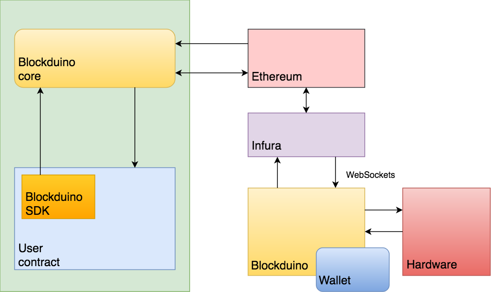

# Blockduino Getting Started

### Setup

Each Blockduino board has an Ethereum account and an associated private key to sign Ethereum transactions originated from its account. The private key is stored in a secure enclave and each operation involving its use is secured by the Trusted Execution Environment.

>The Blockduino account and private key are generated as part of the onboarding process using a dedicated browser extension currently in development.

Before using a Blockduino in a smart-contract and as part of the onboarding process, a board needs to be registered with the Blockduino core contract. In most cases, to control a Blockduino board a smart-contract uses only the functions provided by the [Blockduino SDK](https://github.com/Blockduino/Contracts/blob/master/BlockduinoSDK.sol).

### The Big Picture

The Blockduino core contract and SDK provide high-level functions to control a Blockduino hardware from a smart-contract. The Blockduino SDK is the base class of any smart-contract for Blockduino and the core contract is deployed in the public Ethereum blockchain.



Under the hood, each function in the Blockduino SDK results in a Remote Procedure Call (RPC) to the Blockduino board run-time. The run-time parses the request and takes the corresponding action, which in most cases is to execute instructions that operate on the Blockduino hardware.

All RPC requests are dispatched to the Blockduino board from the core contract, not the SDK. This way is possible to centralize RPC requests and responses, to enforce access privileges, to keep track of all requests and to have additional device management functions.

Once an RPC has been executed by a board, the run-time prepares a transaction with the response, signs it and sends it back to the Blockduino core contract, including the request ID it was received with. 

The Blockduino core contract, using the request ID, dispatches the response calling the callback indicated by the smart-contract executing the SDK request in the first place.

The diagram below illustrates the process for the `generate()` function in the [Randomizer](https://github.com/Blockduino/Randomizer/blob/master/Randomizer.sol) smart-contract:


### Blockduino Interface

The Blockduino core contract interface is composed of two parts:

1. Device Management
2. RPC Dispatcher

Contracts using the Blockduino SDK normally will not have to use any of these functions directly, but they are documented below to explain how the process works. On the other hand a dApp may use the Device Management functions for a fleet of devices.

*Payment of any fee to the Blockduino board is managed by the application smart-contract, not the core contract or the SDK.*

#### Device Management
```
addDevice(address _id,bool _restricted,string _mac_s, string _activaction_key_s) 
```
Register a new Blockduino device as part of the onboarding process. The sender of the transaction becomes the board owner.

| PARAMETER        | DESCRIPTION                      | TYPE                            |
|------------------|----------------------------------|-------------------------------------
| `_id` | the Blockduino device address     | address |
| `_restricted` | permission flag           | bool |
| `_mac_s` | MAC address or unique board id | string |
| `_activaction_key_s` | activation key | string |

>The onboarding process currently does not verify the activation key.

A `True` permission flag indicates that only the board owner can send RPC requests to the board.

A `NewDevice` event is generated after successfully onboarding a new Blockduino:
`event NewDevice(address indexed owner, address id)`

```
deviceAddressesCount() returns (uint)
```

```
getDeviceAddress(uint _index) returns (address)
```

``` 
getDevice(address _addr) returns (address, address, bool, bytes32)
```

```
removeDevice(address _addr) returns (address)
```

#### RPC Dispatcher
```
request(address callbackAddr, bytes4 callbackFID, uint8 _method, address _device, uint8[2] _paramsIntegers, bytes32 _paramsBytes)
```
Propagate an RPC request received from the Blockduino SDK.

| PARAMETER        | DESCRIPTION                      | TYPE                            |
|------------------|----------------------------------|-------------------------------------
| `callbackAddr` | the recipient contract     | address |
| `callbackFID` | the contract callback function ID   | bytes4 |
| `_method` | the RPC method code to execute | uint8 |
| `_device` | the Blockduino device address | address |
| `_paramsIntegers` | the RPC integer array data input parameter | uint8[2] |
| `_paramsBytes` |  the RPC bytes32 data input parameter | bytes32 |

>This function is used by the Blockduino SDK only.

```
response(uint64 requestID, uint64 error, bytes32 respData) 
```
Dispatch a RPC response transaction from the board to the issuing contract.

| PARAMETER        | DESCRIPTION                      | TYPE                            |
|------------------|----------------------------------|-------------------------------------
| `requestID` | the RPC request ID     | uint64 |
| `error` | error status   | uint64 |
| `respData` | the RPC response | bytes32 |

### Example Contract

To show how to develop a contract controlling a Blockduino board, below is described a skeleton `Application` that simply sets the mode of pin D2 a the Blockduino to `OUTPUT` and then sets its state to `HIGH` in the following callback.

Annotate the contract with the proper `pragma` directive and include the Blokduino SDK contract to make available the SDK to the `Application`:
```
pragma solidity ^0.4.24;

import "https://github.com/Blockduino/Contracts/BlockduinoSDK.sol";
```

The `Application` does not need to call the `request()` function directly because RPC requests are provided through the high-level interface in the Blockduino SDK. 

In each function in the SDK the contract needs to specify a callback to be called once the RPC has been executed.

Layout of the `Application` contract:

```
contract Application is usingBlockduinoSDK {
	event BlockduinoApp(string log, address _device, uint64 error, uint response);
	uint constant public FEE = 0.02 ether;
	bytes4 constant PINMODE_CB_FID = bytes4(keccak256("pinModeCallback(uint64,bytes32)"));

	function() public payable;
	constructor (address bcCont) usingBlockduinoSDK(bcCont, msg.sender) public;
	function main(address _device) public payable;
	function pinModeCallback(uint64 error, bytes32 respData) public;
}
```
The event `BlockduinoApp` is for tracing the contract from a dAapp fetching these events from the blockchain.

The `FEE` constant is the value the user of the contract needs to pay to the Blockduino board to execute the `main()` function.

The constant `PINMODE_CB_FID` is the first 4 bytes of the hash of the function pinModeCallback() that the Blockduino core contract calls when relaying the `pinMode()` RPC response from the board.

* `function() public payable;`
The fallback function must be payable so that the Blockduino core contract can provide a refund under certain conditions to the caller of the `main()` function. In the sample application it does nothing:
```
	function() public payable { } 
```

* `constructor (address bcCont) usingBlockduinoSDK(bcCont, msg.sender) public;`
This is the constructor which registers the address of the Blockduino core contract and the owner of this contract with the SDK during creation.

> The Blockduino core contract address in the public Ethereum blockchain for the latest deployed version is available in the [Github page](https://github.com/Blockduino/Contracts/)
Our current deployment on the Ropsten testnet is `0xC859B2826d7c39a5CcA1F651c053523b45AbA64f`.

```
	address owner;
	constructor (address bcCont) usingBlockduinoSDK(bcCont, msg.sender) public {
        owner = msg.sender;
    }
```
* `function main(address _device) public payable;`
A end-user calls this function for instance from a dApp, indicating the address of Blockduino board to execute the performance provided by the contract. In this simple case the contract simply sets the `D2` pin of the board. A `FEE` must be paid by the caller.

In the function, the contract needs only to specify a single action it wants the board to execute on any of the connected hardware. In this case, the action is to set the pin `D2` mode to `OUTPUT`. The `PINMODE_CB_FID` is the function signature as needed by Solidity for the `pinModeCallback()` function to be called once the board has completed the RPC request.

The constants `pin.D2` and `OUTPUT` are defined in the Blockduino SDK contract.

```
	address device;	// save the device address in a global variable for the callback to use

    function main(address _device) public payable {
	    // check fee sent when calling the function
    	require(msg.value >= FEE, "fee paid below minimum.");
    	
		// have the device address in the contract global scope (for use in the callback)
    	device = _device;

    	// set D2 as input pin
	    req_reply = pinMode(device, pin.D2, OUTPUT, PINMODE_CB_FID);
    }
```

* `function pinModeCallback(uint64 error, bytes32 respData) public;`
This is the function called by the Blockduino core contract once the `pinMode()` has been completed. Be aware that some delay to allow for two transaction in the blockchain to be mined - the request and the response - is to be expected.

The callback parameter `respData` contains any data returned by the Blockduino board, and the `error` parameter any error value returned by the board. A positive value indicates success.

In the `pinModeCallback` function a second RPC request is sent to set the `D2` pin to `HIGH`. The null callback is specified in this case, since we will not be tracking its result.

The constants `CONTRACT`, `pin.D2`, `HIGH` and `CB_NULL` are defined in the Blockduino SDK.

```
	function pinModeCallback(uint64 error, bytes32 respData) public {
    	// sender must be the Blockduino contract
    	if (msg.sender != address(CONTRACT)) {
    		return;
    	}

    	// for any dApp to track the callback
    	emit BlockduinoApp("received from pinModeCallback", device, error, uint(respData));

		// set pin D2 to high with no callback needed
    	req_reply = digitalWrite(device, pin.D2, HIGH, CB_NULL);
    }
```


